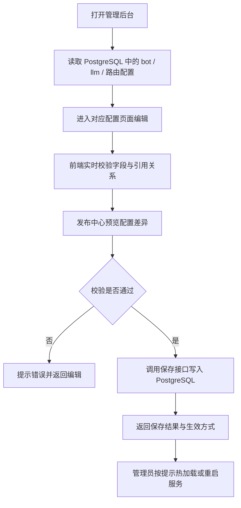

## 1. 产品概述
独立增加一个 Web 管理后台，用于统一维护 bot、LLM 与路由配置，并将配置源统一沉淀到本地 PostgreSQL。
- 面向当前 AI 基础设施维护者，提供可视化配置、校验、保存、预览与发布能力，不再依赖后台鉴权。
- 目标是把 `message-gateway`、`core-service`、`llm-gateway` 三处配置的改动收敛到一个可操作、可检查、可持久化的数据库入口。

## 2. 核心功能

### 2.1 用户角色
| 角色 | 进入方式 | 核心权限 |
|------|----------|----------|
| 运维用户 | 内网访问后台 | 直接查看、编辑、校验、保存 bot / LLM / 路由配置 |

### 2.2 功能模块
1. **总览页**：服务状态摘要、数据库状态、配置摘要、最近更新时间。
2. **Bot 配置页**：维护 bot 凭证、OpenAPI 地址、默认 bot 标记、配置完整性检查。
3. **LLM 配置页**：维护 key、provider、model、默认 provider、启停状态、成本字段。
4. **路由配置页**：维护 bot 到 agent 的映射、默认 agent、未配置 bot 提示预览。
5. **发布中心页**：展示数据库草稿与当前配置 diff、执行保存、提示服务生效方式。

### 2.3 页面详情
| 页面名称 | 模块名称 | 功能描述 |
|----------|----------|----------|
| 总览页 | 服务状态卡片 | 展示 `llm-gateway`、`core-service`、`message-gateway` 的地址、健康状态、最近探测结果 |
| 总览页 | 数据库摘要 | 展示 PostgreSQL 连接状态、表统计、最近更新时间 |
| 总览页 | 配置摘要 | 汇总 bot 数量、可用模型数、路由映射数、默认配置 |
| Bot 配置页 | Bot 列表 | 展示 `bot_id`、`app_id`、`open_base_url`、是否完整 |
| Bot 配置页 | Bot 编辑器 | 新增、编辑、删除 bot；校验必填字段与重复 `bot_id` |
| Bot 配置页 | 数据预览 | 实时生成当前数据库配置快照预览 |
| LLM 配置页 | Key 管理 | 配置 key 名称与环境变量引用，不直接保存真实密钥值 |
| LLM 配置页 | Provider 管理 | 配置 provider 类型、base URL、默认标记、启用状态 |
| LLM 配置页 | Model 管理 | 配置模型名称、上游模型、成本、所属 provider、启停状态 |
| LLM 配置页 | 依赖校验 | 检查 provider 是否引用不存在 key，model 是否引用不存在 provider |
| 路由配置页 | 默认路由 | 配置 `default_agent` 与未配置 bot 的提示文案说明 |
| 路由配置页 | Bot 路由表 | 支持多个 bot 指向同一个 agent，支持搜索与批量检查重复映射 |
| 路由配置页 | 联动提示 | 当 bot 未在 Bot 配置中存在时，给出警告但允许预配置 |
| 发布中心页 | Diff 预览 | 对比数据库当前配置与草稿内容，突出新增、修改、删除 |
| 发布中心页 | 保存发布 | 将三类配置写入 PostgreSQL，并返回成功或失败信息 |
| 发布中心页 | 生效建议 | 对支持热加载的配置给出立即生效提示；对不支持的配置给出重启指引 |

## 3. 核心流程
运维用户进入后台后，先在总览页检查服务与数据库摘要，再分别维护 bot、LLM 与路由，最后在发布中心统一预览差异并保存。
保存时系统先执行结构校验和交叉引用校验，通过后再写入 PostgreSQL 中对应表，并返回是否需要热加载或重启服务。

## 4. 用户界面设计
### 4.1 设计风格
- 主色采用深石墨黑、冷灰与电光青，强调“运维控制台”质感。
- 按钮使用圆角矩形加细边框高亮，危险动作用低饱和红色区分。
- 标题字体偏几何科技感，正文使用高可读无衬线字体，突出数据面板感。
- 布局采用桌面优先的左右分栏与顶部全局导航，核心区域以半透明卡片承载。
- 图标建议使用线性图标与状态圆点，不使用表情元素。

### 4.2 页面设计概览
| 页面名称 | 模块名称 | UI 元素 |
|----------|----------|----------|
| 总览页 | 服务状态卡片 | 深色玻璃卡片、状态圆点、更新时间、悬浮高亮 |
| 总览页 | 数据库摘要 | 表统计、连接状态、最近修改时间、标签分组 |
| 总览页 | 配置摘要 | 大号数字指标、细粒度标签、渐变描边 |
| Bot 配置页 | Bot 列表 | 左侧可搜索列表、右侧详情表单、字段状态提示 |
| Bot 配置页 | 数据预览 | 固定宽度代码面板、差异高亮、复制按钮 |
| LLM 配置页 | Provider / Model 编辑器 | 分段表单、联动下拉、启用开关、成本输入框 |
| 路由配置页 | 路由表格 | 可编辑行、筛选器、重复项高亮 |
| 发布中心页 | Diff 面板 | 左右对比、修改标记、保存按钮与结果提示 |

### 4.3 响应式
桌面优先设计，最小支持到平板宽度；窄屏时导航收缩为侧边抽屉，编辑表单改为单列布局，Diff 区改为上下堆叠。
