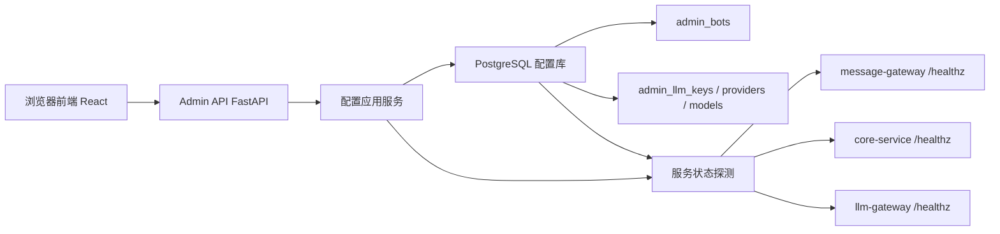
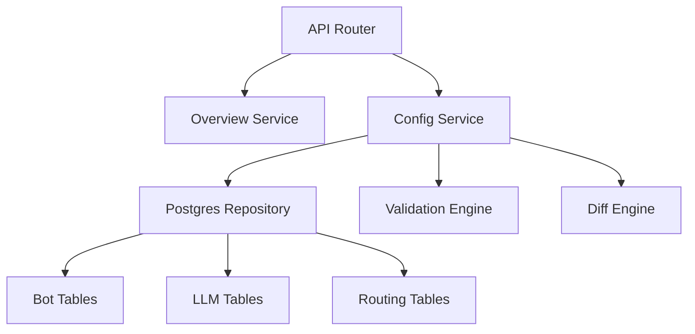
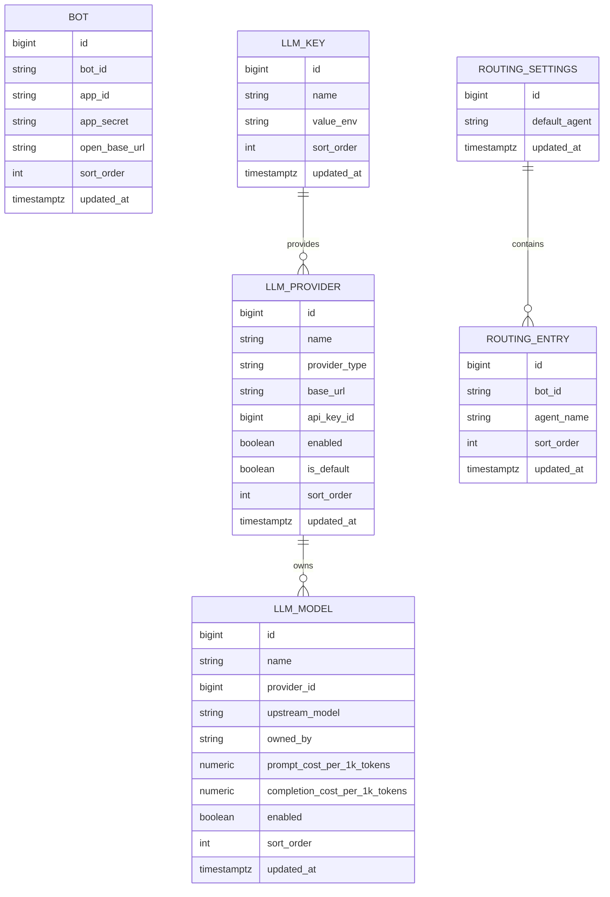

## 1. 架构设计


## 2. 技术说明
- 前端：React 18 + TypeScript + Vite + Tailwind CSS 3 + React Router
- 组件层：自定义控制台风格组件，少量使用图标库，不引入重型 UI 框架
- 后端：FastAPI + Pydantic + Uvicorn + asyncpg
- 存储方式：将 bot / llm / routing 配置写入本地 PostgreSQL，管理后台直接访问数据库
- 部署方式：新增独立 `admin-console` 服务，通过 Docker Compose 连接 `infra-postgres` 中独立的 `admin_console` 数据库
- 运行时分发：`llm-gateway`、`message-gateway`、`core-service` 不再直接读本地 JSON，而是通过 admin runtime API 拉取配置

## 3. 路由定义
| 路由 | 用途 |
|------|------|
| / | 总览页，展示服务状态与配置摘要 |
| /bots | 管理 bot 配置 |
| /llm | 管理 key / provider / model 配置 |
| /routing | 管理 bot 到 agent 路由 |
| /publish | 统一预览 diff 并保存配置 |

## 4. API 定义
```ts
export type BotConfig = {
  bot_id: string;
  app_id: string;
  app_secret: string;
  open_base_url?: string;
};

export type LlmKey = {
  name: string;
  value_env: string;
};

export type LlmProvider = {
  name: string;
  type: string;
  base_url: string;
  api_key_from: string;
  enabled: boolean;
  is_default?: boolean;
};

export type LlmModel = {
  name: string;
  provider: string;
  upstream_model: string;
  owned_by?: string;
  prompt_cost_per_1k_tokens?: number;
  completion_cost_per_1k_tokens?: number;
  enabled: boolean;
};

export type RoutingEntry = {
  bot_id: string;
  agent_name: string;
};

export type RoutingConfig = {
  default_agent: string;
  bots: RoutingEntry[];
};
```

| 方法 | 路径 | 说明 |
|------|------|------|
| GET | /api/overview | 获取服务状态、配置摘要与数据库表信息 |
| GET | /api/config/bots | 读取 bot 配置 |
| PUT | /api/config/bots | 保存 bot 配置并返回校验结果 |
| GET | /api/config/llm | 读取 llm 配置 |
| PUT | /api/config/llm | 保存 llm 配置并返回校验结果 |
| GET | /api/config/routing | 读取路由配置 |
| PUT | /api/config/routing | 保存路由配置并返回校验结果 |
| POST | /api/config/validate | 统一校验三类配置的结构与引用关系 |
| POST | /api/config/diff | 返回当前配置与草稿配置的差异预览 |
| GET | /api/runtime/llm-gateway/catalog | 返回 llm-gateway 直接消费的 catalog |
| GET | /api/runtime/message-gateway/bots | 返回 message-gateway 直接消费的 bot 配置 |
| GET | /api/runtime/message-gateway/routes | 返回 message-gateway 直接消费的路由规则 |
| GET | /api/runtime/core-service/routing | 返回 core-service 直接消费的 routing 配置 |

## 5. 服务端架构图


## 6. 数据模型
### 6.1 数据模型定义


### 6.2 数据定义语言
本方案新增独立 PostgreSQL 数据库 `admin_console`，由管理后台独占使用。

核心表：
- `admin_bots`：bot 配置
- `admin_llm_keys`：llm key 引用
- `admin_llm_providers`：provider 配置，引用 key
- `admin_llm_models`：model 配置，引用 provider
- `admin_routing_settings`：全局默认路由配置
- `admin_routes`：bot -> agent 映射
- `admin_agent_specs`：core-service agent 定义
- `admin_message_route_rules`：message-gateway 路由规则

保存策略：
- 写入前先把请求映射为标准化数据库事务
- 通过单事务替换对应表的当前配置，避免半写入状态
- 每次保存返回 `needs_restart`、`warnings`、`errors` 三类结果，供前端展示
- Diff 预览仍以组合后的配置快照生成，便于前端沿用现有展示模式
